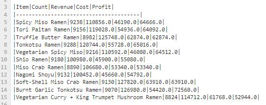

# Module 2 Challenge (PyBank)

## Short Description
Create a Python script that analyses financial records of the company.
The budget_data.csv file is provided that contains financial dataset composed of two columns, Date and Profit/Losses.

## Task
Create a Python script that analyses the records to calculate each of the following:

*The total number of months included in the dataset*

*The net total amount of Profit/Losses over the entire period*

*The average of the changes in Profit/Losses over the entire period*

*The greatest increase in profits (date and amount) over the entire period*

*The greatest decrease in losses (date and amount) over the entire period*

## Expected Output

Financial Analysis
 
----------------------------
  
*Total Months:     86*
  
*Total:            $38382578*

*Average  Change:  $-2315.12*

*Greatest Increase in Profits:   Feb-2012 ($1926159)*

*Greatest Decrease in Profits:   Sep-2013 ($-2196167)*

## Output result into a text file
Final script should print the analysis to the terminal and export a text file with the results.

File name: *financial_analysis.txt*

## Git local copy

# Module 2 Challenge (PyRamen)
This assignment though is optional, pushes me to understand how to manipulate the data by comparing 2 different csv files.

It has 2 parts:
1. Read the Data
2. Manipulate the data

## Read the Data
The following steps should be followed
1. Looping through the sales file gave me a bit of challenge as I was stucked when I initialized 'quantity' variable with the index out-of-range issue.
2. Then, later found out (through the printing the sales list to see the entire list records) that there's an empty [] content in the last records. 
3. I added a if..then validation then initialise the 'quantity' variable to resolve the issue.

## Manipulate the Data
1. Initialise an empty report dictionary to hold the future aggregated per-product results. The report dictionary will eventually contain the following metrics:

    01-count: the total quantity for each ramen type
    02-revenue: the total revenue for each ramen type
    03-cogs: the total cost of goods sold for each ramen type
    04-profit: the total profit for each ramen type
    2. Loop through every row in the sales list object.

   *For each row of the sales data, set the following columns of the sales data to their own variables:*
      Quantity
      Menu_Item

3. Perform a quick check if the sales_item is already included in the report. If not, initialise the key-value pairs for the particular sales_item in the report. Then, set the sales_item as a new key to the report dictionary and the values as a nested dictionary containing the following:
     {
     "01-count": 0,
     "02-revenue": 0,
     "03-cogs": 0,
     "04-profit": 0,
     }
    
4. Create a nested loop by looping through every record in menu.

    For each row of the menu data, set the following columns of the menu data to their own variables:

        Item
        Price
        Cost

    If the sales_item in sales is equal to the item in menu, capture the quantity from the sales data and the price and cost from the menu data to calculate the profit for each item.

5. Cumulatively add the values to the corresponding metrics in the report like so:

        report[sales_item]["01-count"] += quantity
        report[sales_item]["02-revenue"] += price * quantity
        report[sales_item]["03-cogs"] += cost * quantity
        report[sales_item]["04-profit"] += profit * quantity
    
6. Write out the contents of the report dictionary to a text file.
   The report should output each ramen type as the keys and 01-count, 02-revenue, 03-cogs, and 04-profit metrics as the values for every ramen type as shown:
    
   Report.txt
   
