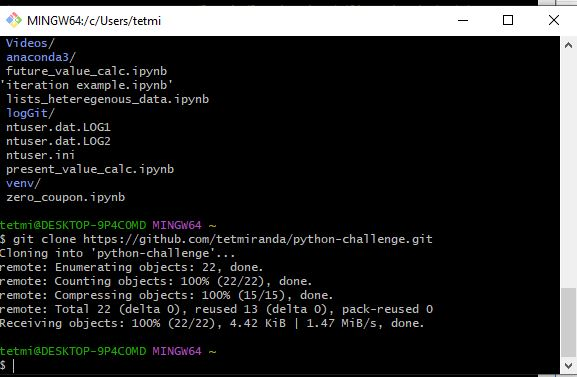

# Module 2 Challenge (PyBank)

## Short Description
Create a Python script that analyses financial records of the company.
The budget_data.csv file is provided that contains financial dataset composed of two columns, Date and Profit/Losses.

## Task
Create a Python script that analyses the records to calculate each of the following:

*The total number of months included in the dataset*

*The net total amount of Profit/Losses over the entire period*

*The average of the changes in Profit/Losses over the entire period*

*The greatest increase in profits (date and amount) over the entire period*

*The greatest decrease in losses (date and amount) over the entire period*

## Expected Output

Financial Analysis
 
----------------------------
  
*Total Months:     86*
  
*Total:            $38382578*

*Average  Change:  $-2315.12*

*Greatest Increase in Profits:   Feb-2012 ($1926159)*

*Greatest Decrease in Profits:   Sep-2013 ($-2196167)*

## Output result into a text file
Final script should print the analysis to the terminal and export a text file with the results.

File name: *financial_analysis.txt*

## Git local copy

